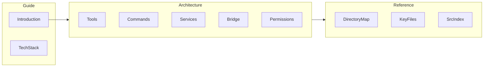
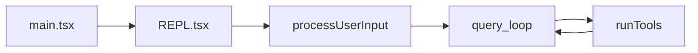

# Architecture overview

The following describes **observed structure** in the mirrored tree for research purposes. It is **descriptive analysis**, not official product documentation.

## Doc map

How this documentation is organized relative to the codebase:

## Subsystems (where to read next)

| Area | Role | Doc page |
|------|------|----------|
| Tools | Agent-invokable capabilities (bash, files, MCP, …) | [Tools](./tools.md) |
| Commands | User `/slash` commands | [Commands](./commands.md) |
| Services | API, MCP, OAuth, LSP, compaction, … | [Services](./services.md) |
| Bridge | IDE ↔ CLI messaging | [Bridge](./bridge.md) |
| Permissions | Tool permission modes and prompts | [Permissions](./permissions.md) |
| Plugins & skills | Extension loading and skill workflows | [Plugins & skills](./plugins-skills.md) |

Root-level orchestration files (see [Key files](../reference/key-files.md)): `main.tsx`, `QueryEngine.ts`, `Tool.ts`, `commands.ts`, `tools.ts`, `context.ts`, `cost-tracker.ts`.

## How a user turn flows (end-to-end)

1. **Bootstrap** — `main.tsx` parses CLI, loads settings/plugins/MCP, sets `bootstrap/state`, then **`launchRepl`** mounts **`screens/REPL.tsx`**. Details: [Runtime & bootstrap](./runtime-bootstrap.md).
2. **Input** — The user types text or a slash command. **`processUserInput`** (`src/utils/processUserInput/processUserInput.ts`) resolves commands via **`commands.ts`**, builds user/system messages, and may set `shouldQuery` for the model.
3. **Query** — **`QueryEngine`** / **`query`** (`src/query.ts`) runs the **multi-iteration** loop: stream from API → optional **tool_use** → **`runTools`** → append **tool_result** → repeat or exit on stop/error/budget. Details: [Query loop](./query-loop.md).
4. **Tools** — **`runTools`** partitions calls into safe concurrent batches vs serial runs, then **`runToolUse`** runs hooks, **`canUseTool`** (permissions), and the tool body. Details: [Tool execution](./tool-execution.md).

## Execution docs (read in order)

| Page | You learn |
|------|-----------|
| [Runtime & bootstrap](./runtime-bootstrap.md) | Import-order prefetch, Commander, init, `launchRepl` |
| [Query loop](./query-loop.md) | `query` generator, compaction, API iteration |
| [Tool execution](./tool-execution.md) | `partitionToolCalls`, `runToolUse`, hooks |
