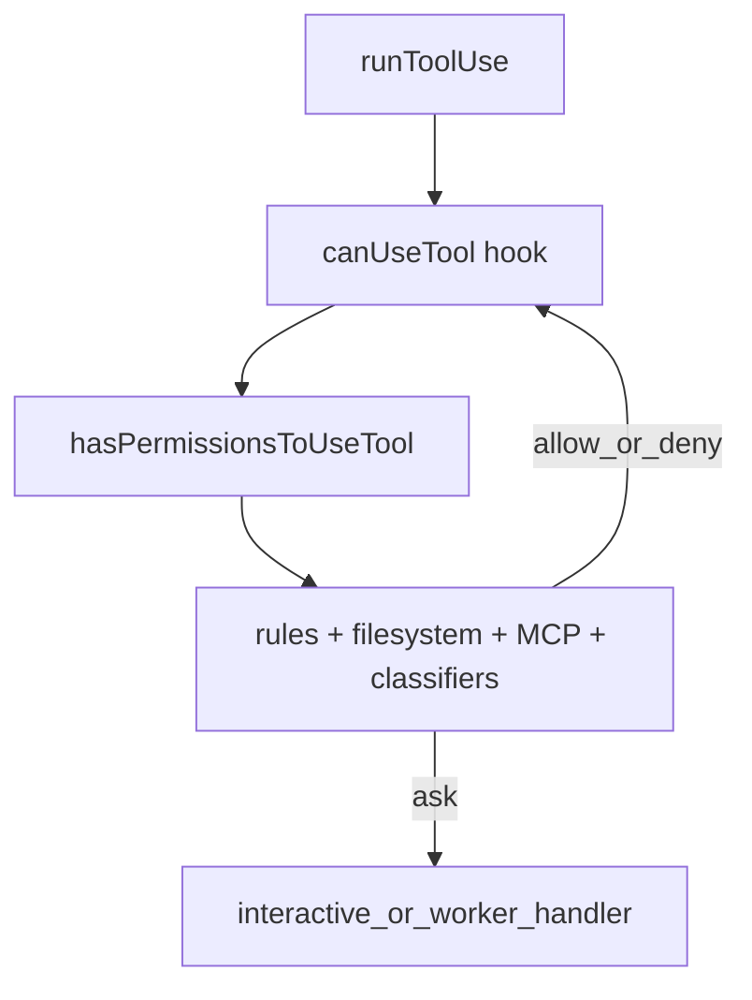

# Permission system

Tool invocations do not run blindly: every **`tool_use`** goes through **`canUseTool`** (see [Tool execution](./tool-execution.md)) which bridges into this stack.

## Layers

### 1. React hook: `useCanUseTool` (`src/hooks/useCanUseTool.tsx`)

The interactive **`CanUseToolFn`** wraps decisions in a **Promise** resolved when:

- **`hasPermissionsToUseTool`** returns **allow** (possibly after updating input, e.g. path normalization), or
- The user responds in the UI, or
- A **forced** decision is passed (replay / tests / SDK).

On **allow** from classifier-based auto-mode, it may call **`setYoloClassifierApproval`** when `TRANSCRIPT_CLASSIFIER` is enabled. On **ask**, it computes a human-readable **`tool.description`** for the prompt, then dispatches by behavior (**deny**, **ask**, etc.).

### 2. Core rules engine: `permissions.ts` (`src/utils/permissions/permissions.ts`)

**`hasPermissionsToUseTool`** is the large central function: it combines **permission mode**, **per-tool rules** (including managed/enterprise rules), **bash/shell** special cases (sandbox, redirections), **MCP tool** naming, **classifier** and **auto-mode** state (`TRANSCRIPT_CLASSIFIER` feature), and **hooks** such as **`executePermissionRequestHooks`**. It returns a **`PermissionResult`**: allow, deny, or ask-with-context.

Supporting modules include **`PermissionRule`**, **`PermissionUpdate`**, **`classifierDecision`**, **`filesystem.ts`** (path allowlists, scratchpad, gitignore-style rules), and **`PermissionMode`** (`default`, `plan`, `bypassPermissions`, `auto`, …).

### 3. Mode handlers (`src/hooks/toolPermission/handlers/`)

When the UI must block for a human:

- **`interactiveHandler`** — normal REPL prompts (`PermissionRequest` components).
- **`swarmWorkerHandler`** — worker agents waiting on permission from the main thread.
- **`coordinatorHandler`** — coordinator / multi-agent permission routing.

**`PermissionContext.ts`** builds the context object and queue operations shared by handlers.

### 4. UI

**`src/components/permissions/`** — dialogs for plan mode exit, ask-user questions, worker pending state, etc.

### 5. Setup at startup

**`src/utils/permissions/permissionSetup.ts`** (invoked from **`main.tsx`**) parses CLI tool lists, initializes **`initializeToolPermissionContext`**, applies **auto-mode** gates, and can **strip dangerous permissions** when switching to auto mode.

## Flow (simplified)

Related: [Tool execution](./tool-execution.md), [Tools](./tools.md), `src/tools/BashTool/bashPermissions.ts` (speculative classification for shell).
