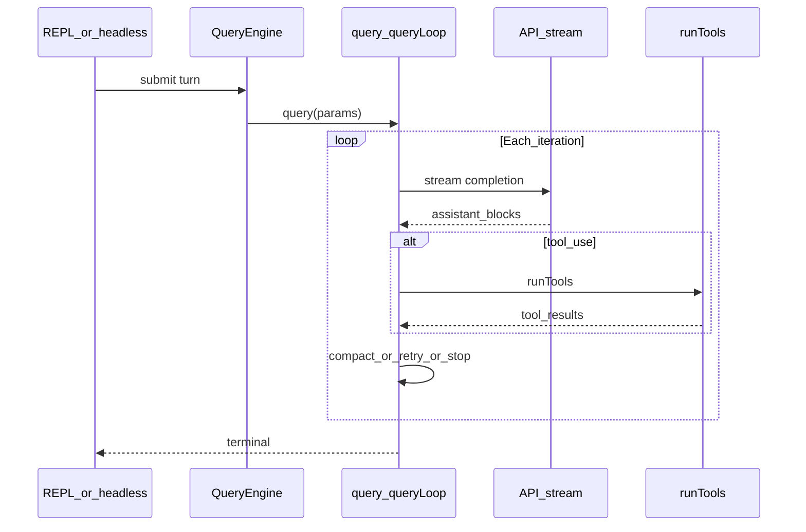

# Query loop (`query.ts` + `QueryEngine.ts`)

The **LLM turn** is not a single HTTP call: it is a **state machine** that can repeat until the model stops, errors, or hits budgets. The core implementation is split between:

- **`src/query.ts`** — the **`query` / `queryLoop`** async generator: streaming, token/compaction logic, invoking tools, and **continuations** (“continue” transitions) for retries and recovery.
- **`src/QueryEngine.ts`** — higher-level **session-facing** API: builds prompts, merges system/user context, memory, MCP, message normalization, and calls into `query`. The convenience **`ask()`** export constructs a `QueryEngine` for non-interactive one-shot use.

## `query()` shape

`export async function* query(params)` wraps **`queryLoop`** and, on normal completion, notifies command lifecycle for consumed command UUIDs. The generator yields:

- Stream events and **request start** markers
- **Messages** (assistant, user, tool summaries, tombstones, …)
- A **terminal** value when the turn ends

So consumers (REPL, headless, SDK) **iterate** the generator and render or record each yielded piece.

## One iteration of `queryLoop` (simplified)

Each loop cycle roughly:

1. **Snapshot config** — `buildQueryConfig()` freezes session id and runtime gates (Statsig/env), *not* `feature()` flags (those stay inline for tree-shaking).
2. **Prefetch** — `startRelevantMemoryPrefetch` runs once per user turn; optional skill discovery prefetch may run per iteration.
3. **Emit** `stream_request_start` for UI/analytics.
4. **Query chain tracking** — assigns/increments `queryTracking` (chain id + depth) for nested/sub-agent calls.
5. **Prepare messages** — copy messages after the last compact boundary; **`applyToolResultBudget`** may shrink or replace large tool results before the API sees them; **snip** / **microcompact** / **reactive compact** paths may further trim context (feature-gated).
6. **Call the API** (via injected **`deps`**, default **`productionDeps()`**) with normalized messages, system prompt, tools list, etc.
7. **Stream** assistant content; on **tool_use** blocks, hand off to **`runTools`** (`toolOrchestration.ts`) and merge **tool_result** messages back into history.
8. **Decide next transition** — e.g. continue for another model call, stop on finish, handle length errors with compact/recovery, honor **stop hooks**, **token budget**, **max turns**, **task_budget** hints.

Comments in `query.ts` document edge cases: e.g. **`taskBudgetRemaining`** exists because after compaction the server only sees summarized history and would otherwise under-count spend unless the client sends remaining budget metadata.

## `QueryEngine` vs `query`

**`QueryEngine`** is the object-oriented façade used from the REPL: it owns **`QueryEngineConfig`** (cwd, tools, commands, MCP clients, agents, `canUseTool`, app state getters/setters, file read cache, model, budgets, …). It prepares **`processUserInput`**-driven or direct message lists and delegates the actual multi-step sampling loop to **`query`**.

**`ask()`** is documented as a **non-interactive** helper: it assumes permissions are already resolved and builds a short-lived engine.

## Related modules

| Module | Role |
|--------|------|
| `src/query/config.ts` | `QueryConfig` snapshot; separates immutable config from per-iteration `State` |
| `src/query/deps.ts` | Injectable API/stream implementation (tests vs production) |
| `src/query/tokenBudget.ts` | Per-turn token budget tracking when enabled |
| `src/services/compact/*.ts` | Auto-compact, micro-compact, post-compact message rebuild |
| `src/services/tools/StreamingToolExecutor.ts` | Streaming execution path when feature gate allows |
| `src/utils/messages.ts` | Normalization, tool summaries, system messages |
| `src/utils/queryHelpers.ts` | Orphaned permissions, success checks, normalization helpers |

## Flow diagram

Next: [Tool execution](./tool-execution.md).
