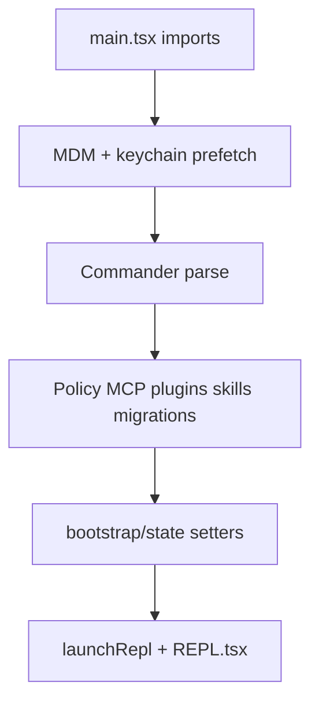

# Runtime and bootstrap (`main.tsx`)

The CLI entrypoint is `src/main.tsx`. Understanding its **import order** and **branching** explains why cold start behaves the way it does and where global side effects enter.

## Top-of-file side effects (before the rest of the module graph)

The file intentionally runs work **before** most imports finish evaluating:

1. **`profileCheckpoint('main_tsx_entry')`** — marks the very start of startup profiling.
2. **`startMdmRawRead()`** — kicks off MDM-related subprocess work (`plutil` / registry queries) so it overlaps with the remaining import phase (~on the order of 100ms+ of module loading).
3. **`startKeychainPrefetch()`** — starts **parallel** macOS keychain reads (OAuth + legacy API key). Without this, some code paths would read the keychain **sequentially** via synchronous spawns on every macOS startup (comments in source cite ~65ms sequential cost).

This is the **parallel prefetch** pattern described in the reference docs: hide I/O latency behind module import time.

## Commander, config, and feature gates

After imports resolve, `main.tsx` uses **Commander.js** (`@commander-js/extra-typings`) to define subcommands and global options. Many code paths are wrapped in **`feature('FLAG')` from `bun:bundle`**: dead branches are stripped in upstream Bun builds, so the mirror may still contain `require()` inside `feature(...)` ternaries for things like:

- `COORDINATOR_MODE` → coordinator helpers
- `KAIROS` → assistant / “Kairos” mode modules
- `TRANSCRIPT_CLASSIFIER` → auto-mode / classifier state

Treat those as **optional subsystems** that may be absent in a given binary.

## What gets initialized before the REPL

Typical startup work (exact order varies by flags) includes:

- **GrowthBook** (`initializeGrowthBook`, env overrides) for feature gates and experiments.
- **Policy / remote settings** — `loadPolicyLimits`, `loadRemoteManagedSettings`, eligibility checks.
- **Bootstrap API** — `fetchBootstrapData`, referral prefetch, official MCP URL prefetch.
- **Permissions** — `initializeToolPermissionContext`, `initialPermissionModeFromCLI`, auto-mode gates, stripping dangerous permissions in auto mode.
- **Plugins and skills** — `initBuiltinPlugins`, `initBundledSkills`, versioned plugin loading; some cleanup runs in background.
- **MCP** — parsing configs, enterprise policy filtering, `getMcpToolsCommandsAndResources`, optional Clawd Web MCP fetch.
- **LSP** — `initializeLspServerManager` when applicable.
- **Migrations** — a series of `migrate*` modules normalize legacy config into current settings.

Global **session/process state** lives in `src/bootstrap/state.ts` (see below). `main.tsx` and `launchRepl` paths set IDs, cwd, model overrides, channel allowlists, and similar fields consumed everywhere else.

## Entering the interactive UI

**`launchRepl`** (`src/replLauncher.tsx`) is invoked from multiple branches in `main.tsx` depending on CLI mode (interactive REPL, resume, remote, etc.). It mounts the Ink/React tree; the main screen implementation is **`src/screens/REPL.tsx`**, which wires:

- `PromptInput`, message list, permission dialogs (`PermissionRequest`, worker pending UI).
- Hooks into **`getCommands` / `commands.ts`** for slash commands and **`QueryEngine` / `query`** for model turns.
- Budget, cost, and session counters from **`bootstrap/state`**.

## Mental model

## Key files

| Path | Role |
|------|------|
| `src/main.tsx` | CLI entry, Commander, startup orchestration |
| `src/replLauncher.tsx` | Ink/React bootstrap for REPL |
| `src/screens/REPL.tsx` | Main interactive loop UI and query wiring |
| `src/bootstrap/state.ts` | Process-wide mutable state (cwd, session, costs, OTel counters, …) |
| `src/utils/permissions/permissionSetup.ts` | CLI/session permission mode setup |
| `src/entrypoints/init.ts` | Trust / telemetry init hooks referenced from main |

Next: [Query loop](./query-loop.md) and [Tool execution](./tool-execution.md).
