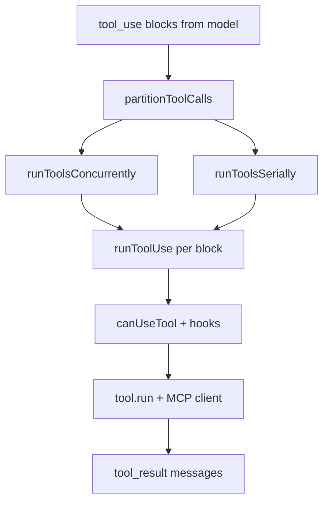

# Tool execution pipeline

When the model emits **tool_use** blocks, the client must run tools, produce **tool_result** blocks, and feed them back into the next API call. The mirrored code does this through a layered pipeline.

## Orchestration: `runTools` (`src/services/tools/toolOrchestration.ts`)

**`runTools`** is an **async generator** that yields **`MessageUpdate`** objects (optional new message + updated **`ToolUseContext`**).

### Partitioning: concurrency vs seriality

Tool calls are **not** all parallel. The reducer **`partitionToolCalls`** walks the model’s tool_use list and builds **batches**:

1. Each batch is either **one non-read-only tool**, or **a run of consecutive read-only tools**.
2. **Read-only** is determined per tool via **`tool.isConcurrencySafe(parsedInput)`** after **`inputSchema.safeParse`**. If parsing or `isConcurrencySafe` throws, the tool is treated as **not** concurrency-safe (conservative).

**Concurrency-safe batches** run through **`runToolsConcurrently`**: multiple tools overlap; **context modifiers** from each tool may be queued per `toolUseID` and applied **after** the batch completes so shared context updates stay ordered.

**Non-safe batches** run through **`runToolsSerially`**: each tool_use completes (including permission UI and execution) before the next starts. **`setInProgressToolUseIDs`** tracks in-flight IDs for the UI.

### Environment knob

**`CLAWD_CODE_MAX_TOOL_USE_CONCURRENCY`** (default 10) caps parallel tool execution.

## Single tool: `runToolUse` (`src/services/tools/toolExecution.ts`)

Each tool goes through roughly:

1. **Telemetry spans** — start/end tool spans, “blocked on user” spans when waiting for permission.
2. **Pre-tool hooks** — `runPreToolUseHooks` (and related permission hook resolution).
3. **Permission / `canUseTool`** — the **`CanUseToolFn`** from React (`useCanUseTool`) or headless implementations; may block on UI or deny.
4. **Execution** — invoke the tool’s run handler; MCP tools go through MCP client code paths; errors are **classified** for telemetry (`classifyToolError` avoids minified constructor names).
5. **Post-tool hooks** — success/failure hooks, permission-denied hooks, **`processToolResultBlock`** / storage limits.
6. **Progress messages** — user-visible progress and hook timing when over thresholds.

Bash-related tools can start **speculative classifier** work early (`bashPermissions`) so permission/automation decisions overlap with other work.

## Permission hook-in

**`canUseTool`** is typed in `src/hooks/useCanUseTool.tsx`. It:

- Builds a **permission context** and queue ops.
- If not forced, calls **`hasPermissionsToUseTool`** (`src/utils/permissions/permissions.ts`) which implements rules, managed settings, classifiers, ask/deny, etc.
- On **allow**, may record classifier approvals for auto-mode.
- On **ask**, routes to **interactive**, **coordinator**, or **swarm worker** handlers depending on session mode.

So **orchestration** (`runTools`) assumes permission is synchronous from its perspective but **`canUseTool`** may **await** user input in the REPL.

## Streaming tools

When **`buildQueryConfig().gates.streamingToolExecution`** is true (Statsig gate `tengu_streaming_tool_execution2`), **`StreamingToolExecutor`** can participate in the loop so partial output or streaming semantics apply for supported tools—see `src/query.ts` imports and branches.

## Mental model

## Key files

| Path | Role |
|------|------|
| `src/services/tools/toolOrchestration.ts` | Batching, concurrent vs serial runs |
| `src/services/tools/toolExecution.ts` | One tool_use lifecycle, hooks, errors |
| `src/services/tools/toolHooks.ts` | Pre/post hook dispatch |
| `src/hooks/useCanUseTool.tsx` | `CanUseToolFn` implementation for interactive UI |
| `src/utils/permissions/permissions.ts` | Core allow/deny/ask logic |
| `src/Tool.ts` | Tool interface, schemas, `isConcurrencySafe` |

Related: [Permissions](./permissions.md), [Tools](./tools.md) (catalog).
