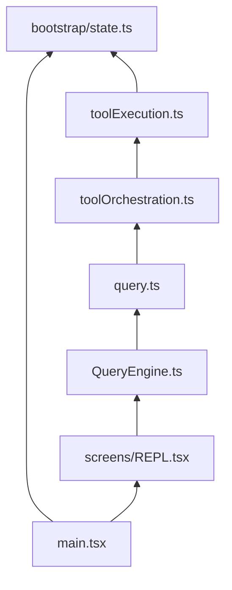

# Key files

Very large files dominate complexity; treat them as **entry surfaces** and use editor search and the [src index](./src-index.md) to drill down.

## `QueryEngine.ts` (~46K lines)

Core engine for LLM API calls: streaming responses, tool-call loops, thinking mode, retry logic, token counting.

## `Tool.ts` (~29K lines)

Base types and interfaces for tools — input schemas, permission models, progress state types.

## `commands.ts` (~25K lines)

Registration and execution of slash commands; conditional imports for environment-specific command sets.

## `main.tsx`

Commander.js-based CLI parsing and React/Ink renderer setup; startup paths include MDM settings, keychain prefetch, and GrowthBook initialization for boot performance.

## Other useful anchors

| Path | Role |
|------|------|
| `src/tools.ts` | Tool registration |
| `src/context.ts` | System / user context |
| `src/services/mcp/client.ts` | MCP client |
| `src/utils/permissions/filesystem.ts` | Filesystem permission logic |

## Dependency direction (who imports whom)

- **`Tool.ts`** is imported by almost all tools and by orchestration; avoid circular reads by starting from **`tools.ts`** (registry) not **`Tool.ts`** internals.
- **`commands.ts`** imports many command modules; individual commands under **`src/commands/`** should stay as leaf-heavy as possible.

## Smaller but important

| Path | Role |
|------|------|
| `src/utils/processUserInput/processUserInput.ts` | Slash commands, attachments, `shouldQuery` |
| `src/utils/messages.ts` | Message constructors and API normalization |
| `src/query/config.ts` | Per-query immutable gates |
| `src/services/tools/toolHooks.ts` | Pre/post tool hooks |
| `src/context.ts` | `getUserContext` / `getSystemContext` for prompts |

See also [Design patterns](./design-patterns.md) and the [Architecture overview](../architecture/overview.md).
